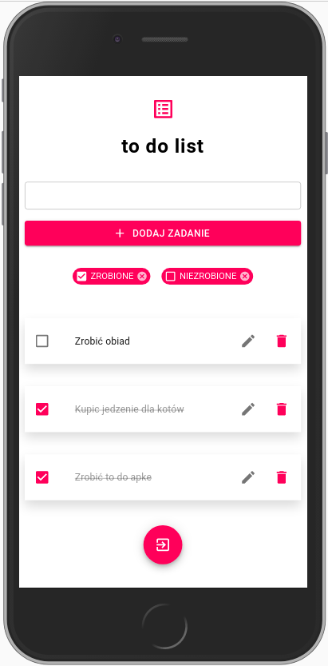

# to-do-app

Simple to-do-app created with **React.js**, **Firebase** and **Material-UI**.

**Live demo**: _https://rutkows-anna.github.io/to-do-app/_



## Table of contents
* [General info](#general-info)
* [Features](#features)
* [Technologies](#technologies)
* [Setup](#setup)

## General info
This project is a simple to do list made for practise.
	
## Features
User can:
* sign in/sign up
* add task
* mark task as done or undone
* edit task
* delete task
* sort tasks by done/undone

## Technologies
Project is created with:
* React.js
* Firebase
* Material-UI
	
## Setup
To run this project, install it locally using npm:

```
$ npm install
$ npm start
```